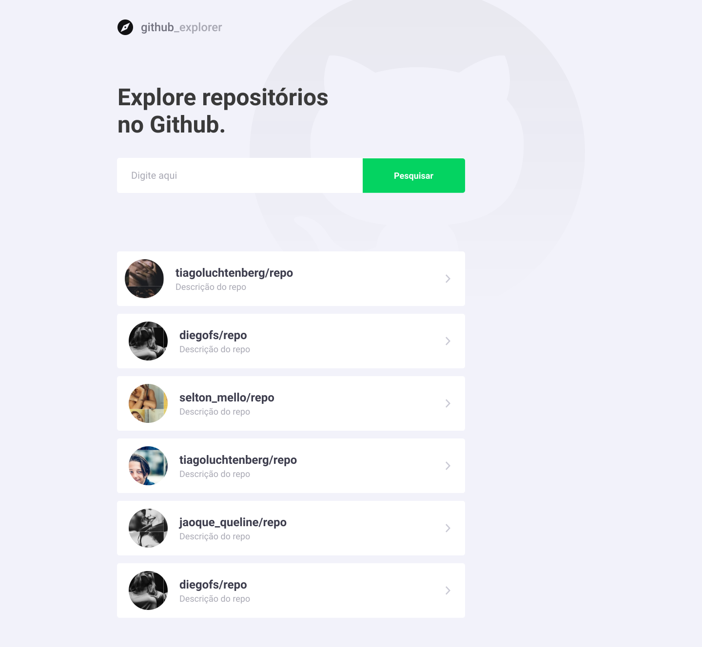

<h1 align="center">
    
</h1>

## 💻 About

📁 GitHub Explorer - Single page application ( SPA ) built with ReactJS and TypeScript to explore GitHub repositories. This project enables you to save and list repositories and offers an easy way to access the repository issues page.
It was built as an exercise of Rocketseat's GoStack Bootcamp to put in practice the studies of ReactJS, React Hooks, Styled Components, React Router Dom, responsive layout and GitHub Pages for deploy.
This project connects to GitHub official API to get the data.


Project developed during **GoStack** offered by [RocketSeat Team](https://rocketseat.com.br).


## 🎨 Layout

The layout of the application is available in Figma:

<a href="https://www.figma.com/file/HOCmxfrElzLpI75LdzFLia/Github-Explorer?node-id=0%3A1">
  
</a>

### Web

<p align="center" style="display: column; align-items: flex-start; justify-content: center;">
  
  
</p>

## 🛠 Technologies

The following tools were used in the construction of the project:

- [React][React]
- [TypeScript][TypeScript]
- [Styled Components][Styled Components]
- [Axios][Axios]
- [React Router DOM][React Router DOM]
- [React Icons][React Icons]

## 🚀 Getting Started

1. Front End

### 🎲 Running the Front End and API

```bash
# Clone this repository
$ git clone https://github.com/caioperess/github-explorer.git

# Go to the project folder in terminal/cmd
$ cd github-explorer

# Install the dependencies
$ yarn

# Run the application in development mode
$ yarn start

# The server will start on port:3000 - go to http://localhost:3000
```

## 📝 License

This project is under the MIT license. Consult the [LICENSE](LICENSE.md) to more details.

## 👏 Acknowledgements

- [Rocketseat Team](https://rocketseat.com.br)
- [Diego Fernandes, CTO at Rocketseat](https://github.com/diego3g)

---
Made by Caio Peres 👋🏽 [Contact me!](https://github.com/caioperess)

[React]: https://reactjs.org
[Typescript]: https://www.typescriptlang.org/
[Styled Components]: https://styled-components.com
[Axios]: https://blog.rocketseat.com.br/axios-um-cliente-http-full-stack/
[React Router DOM]: https://reactrouter.com/web/guides/quick-start
[React Icons]: https://react-icons.github.io/react-icons/
